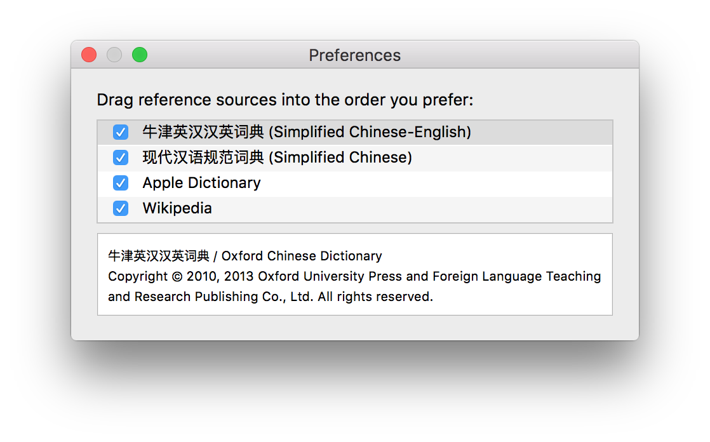

# dict    
terminal dictionary - mac

## How to use

1. download executable binary file [here](https://github.com/Urinx/dict/releases)
2. copy it in `/usr/local/bin` or any other search path in `$PATH`

**Change language**

open `Dictionary` -> `Preferences`

